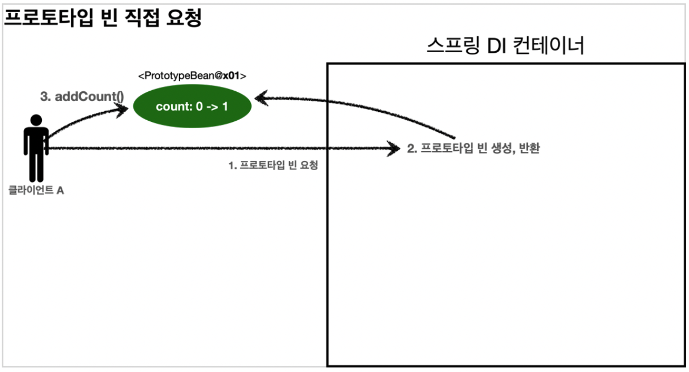
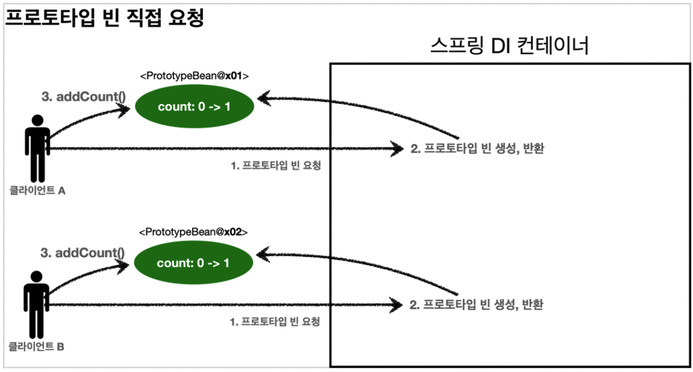

# 빈 스코프


## 목차

1. 빈 스코프란?
2. 프로토타입 스코프
3. 프로토타입 스코프 - 싱글톤 빈과 함께 사용시 문제점
4. 프로토타입 스코프 - 싱글톤 빈과 함께 사용시 Provider로 문제 해결
5. 웹 스코프
6. request 스코프 예제 만들기
7. 스코프와 Provider
8. 스코프와 프록시

------


## 1. 빈 스코프란?

빈 스코프는 말 그대로 빈이 존재할 수 있는 범위를 뜻한다.

### 스프링은 다음과 같은 다양한 스코프를 지원한다.

- **싱글톤:** 기본 스코프, 스프링 컨테이너의 시작과 종료까지 유지되는 가장 넓은 범위의 스코프이다.
- **프로토타입:** 스프링 컨테이너는 프로토타입 빈의 생성과 의존관계 주입까지만 관여하고 더는 관리하지 않는 매우 짧은 범위의 스코프이다.
- 웹 관련 스코프:
  - **request:** 웹 요청이 들어오고 나갈때까지 유지되는 스코프이다.
  - **session:** 웹 세션이 생성되고 종료될 때까지 유지되는 스코프이다.
  - **application:** 웹의 서블릿 컨텍스트와 같은 범위로 유지되는 스코프이다.

### 빈 스코프는 다음과 같이 지정할 수 있다.

컴포넌트 스캔 자동 등록

```java
@Scope("prototype")
@Component
public class HelloBean {}
```

수동 등록

```java
@Scope("prototype")
@Bean
PrototypeBean HelloBean() {
		return new HelloBean();
}
```

지금까지 싱글톤 스코프를 계속 사용해보았으니, 프로토타입 스코프부터 확인해보자.


## 2. 프로토타입 스코프

프로토타입 스코프를 스프링 컨테이너에 조회하면 스프링 컨테이너는 항상 새로운 인스턴스를 생성해서 반환한다.

1. 프로토타입 스코프 빈을 스프링 컨테이너에 요청한다.
2. 스프링 컨테이너는 이 시점에 프로토타입 빈을 생성하고, 필요한 의존관계를 주입한다.
3. 스프링 컨테이너는 생성한 프로토타입 빈을 클라이언트에 반환한다.
4. 이후에 스프링 컨테이너에 같은 요청이 오면 항상 새로운 프로토타입 빈을 생성해서 반환한다.

### 정리

- 스프링 컨테이너에 요청할 때 마다 빈이 새로 생성된다.
- 스프링 컨테이너는 프로토타입 빈을 생성하고, 의존관계 주입, 초기화까지만 처리한다.
- 프로토타입 빈을 관리하는 책임은 빈을 주입받은 클라이언트에 있다.
  - @PreDestroy 같은 종료 메서드를 스프링 컨테이너가 호출하지 않는다.


## 3. 프로토타입 스코프 - 싱글톤 빈과 함께 사용시 문제점

프로토타입 빈을 요청하면 항상 새로운 객체 인스턴스를 생성해서 반환한다.

하지만 싱글톤 빈과 함께 사용할 때는 의도한대로 잘 동작하지 않으므로 주의해야 한다.

### 프로토타입 빈 직접 요청



1. 클라이언트 A는 스프링 컨테이너에 프로토타입 빈을 요청한다.
2. 스프링 컨테이너는 프로토타입 빈을 새로 생성해서 반환(**x01**)한다. 해당 빈의 count 필드 값은 0이다.
3. 클라이언트는 조회한 프로토타입 빈에 addCount()를 호출하면서 count 필드를 +1 한다.
4. 결과적으로 프로토타입 빈(**x01**)의 count는 1이 된다.



1. 클라이언트B는 스프링 컨테이너에 프로토타입 빈을 요청한다.
2. 스프링 컨테이너는 프로토타입 빈을 새로 생성해서 반환(x02)한다. 해당 빈의 count 필드 값은 0이다.
3. 클라이언트는 조회한 프로토타입 빈에 addCount() 를 호출하면서 count 필드를 +1 한다.
4. 결과적으로 프로토타입 빈(x02)의 count는 1이 된다.

### 싱글톤 빈에서 프로토타입 빈 사용

이번에는 clientBean이라는 싱글톤 빈이 의존관계 주입을 통해서 프로토타입 빈을 주입받아서 사용하는 예를 보자.

- clientBean은 싱글톤이므로, 보통 스프링 컨테이너 생성시점에 함께 생성되고 의존관계 주입도 발생한다.

  

1. clientBean은 의존관계 자동 주입을 사용한다. 주입 시점에 스프링 컨테이너에 프로토타입 빈을 요청한다.

2. 스프링 컨테이너는 프로토타입 빈을 생성해서 clientBean에 반환한다. 프로토타입 빈의 count 필드 값은 0이다.

3. clientBean은 프로토타입 빈을 내부 필드에 보관한다. (정확히는 참조값을 보관한다.)

4. clientBean은 프로토타입 빈의 addCount()를 호출해서 count 를 증가한다. count의 값은 1이 된다.

   

5. 클라이언트 B는 clientBean을 스프링 컨테이너에 요청해서 받는다. 싱글톤이므로 항상 같은 clientBean이 반환된다.

   - 여기서 중요한 점은 clientBean이 내부에 가지고 있는 프로토타입 빈은 이미 주입이 끝난 빈이다.
   - 주입 시점에 스프링 컨테이너에 요청해서 프로토타입 빈이 새로 생성된 것이지, 사용할 때마다 새로 생성되는 것이 아니다.

   

6. 클라이언트 B는 addCount()를 호출해서 프로토타입 빈의 count를 증가한다. 원래 1이었으므로 2가 된다.

아마 원하는 것이 이런 것은 아닐 것이다. 프로토타입 빈을 주입 시점에만 새로 생성하는게 아니라, 사용할 때 마다 새로 생성해서 사용하는 것을 원할 것이다.


## 4. 프로토타입 스코프 - 싱글톤 빈과 함께 사용시 Provider로 문제 해결

싱글톤 빈과 프로토타입 빈을 함께 사용할 때, 어떻게 사면 사용할 때 마다 새로운 프로토타입 빈을 생성할 수 있을까?

### 스프링 컨테이너에 요청

가장 간단한 방법은 싱글톤 빈이 프로토타입을 사용할 때 마다 스프링 컨테이너에 새로 요청하는 것이다.

```java
@Autowired
private ApplicationContext ac;

public int logic() {
		PrototypeBean prototypeBean = ac.getBean(PrototypeBean.class);
		prototypeBean.addCount();
		int count = prototypeBean.getCount();
		return count;
}
```

- 실행해보면 ac.getBean()을 통해서 항상 새로운 프로토타입 빈이 생성되는 것을 확인할 수 있다.
- 의존관계를 외부에서 주입받는게 아니라 이렇게 직접 필요한 의존관계를 찾는 것을 Dependency Lookup (DL) 의존관계 조회(탐색)이라 한다.
- 이렇게 스프링 애플리케이션 컨텍스트 전체를 주입받게 되면, 스프링 컨테이너에 종속적인 코드가 되고 단위 테스트도 어려워진다.
- 지금 상태에서 지정한 프로토타입 빈을 컨테이너에서 대신 찾아주는 DL 정도의 기능만 제공하는 무언가가 있으면 된다.

### ObjectFactory, ObjectProvider

지정한 빈을 컨테이너에서 대신 찾아주는 DL 서비스를 제공하는 것이 바로 ObjectProvider이다.

> 참고: 과거에는 ObjectFactory가 있었는데, 여기에 편의 기능을 추가해서 ObjectProvider가 만들어 졌다.

```java
@Autowired
private ObjectProvider<PrototypeBean> prototypeBeanProvider;

public int logic() {
		PrototypeBean prototypeBean = prototypeBeanProvider.getObject();
		prototypeBean.addCount();
		int count = prototypeBean.getCount();
		return count;
}
```

- 실행해보면 prototypeBeanProvider.getObject()를 통해서 항상 새로운 프로토타입 빈이 생성되는 것을 확인할 수 있다.
- ObjectProvider의 getObject()를 호출하면 내부에서는 스프링 컨테이너를 통해 해당 빈을 찾아서 반환한다. (**DL**)
- 스프링이 제공하는 기능을 사용하지만, 기능이 단순하므로 단위테스트를 만들거나 mock 코드를 만들기는 훨씬 쉬워진다.
- ObjectProvider는 지금 필요한 DL 정도의 기능만 제공한다.

**특징**

- ObjectFactory: 기능이 단순, 별도의 라이브러리 필요 없음, 스프링에 의존
- ObjectProvider: ObjectFactory 상속, 옵션, 스트림 등 편의 처리 기능이 많고, 별도의 라이브러리 필요 없음, 스프링에 의존

### JSR-330 Provider

마지막 방법은 javax.inject, Provider라는 JSR-330 자바 표준을 사용하는 방법이다.

이 방법을 사용하려면 javax.inject:javax.inject:1 라이브러리를 gradle에 추가해야 한다.

```java
@Autowired
private Provider<PrototypeBean> provider;

public int logic() {
		PrototypeBean prototypeBean = provider.get();
		prototypeBean.addCount();
		int count = prototypeBean.getCount();
		return count;
}
```

- 실행해보면 provider.get()를 통해서 항상 새로운 프로토타입 빈이 생성되는 것을 확인할 수 있다.
- provider의 get()을 호출하면 내부에서는 스프링 컨테이너를 통해 해당 빈을 찾아서 반환한다. (**DL**)
- 자바 표준이고, 기능이 단순하므로 단위테스트를 만들거나 mock 코드를 만들기는 훨씬 쉬워진다.
- Provider는 지금 필요한 DL 정도의 기능만 제공한다.

**특징**

- get() 메서드 하나로 기능이 매우 단순하다.
- 별로의 라이브러리가 필요하다.
- 자바 표준이므로 스프링이 아닌 다른 컨테이너에서도 사용할 수 있다.

### 정리

- 프로토타입 빈은 매번 사용할 때 마다 의존관계 주입이 완료된 새로운 객체가 필요하면 사용하면 된다.
- 그러나 실무에서는 싱글톤으로 대부분의 문제를 해결할 수 있기 때문에 프로토타입 빈을 직접적으로 사용하는 일은 매우 드물다.
- ObjectProvider, JSR-330 Provider 등은 프로토타입 뿐만 아니라 DL이 필요한 경우는 언제든지 사용할 수 있다.

> 참고: 스프링이 제공하는 메서드에 @Lookup 애노테이션을 사용하는 방법도 있지만, 이전 방법들도 충분하고, 고려해야 할 내용도 많아서 생략했다.


## 5. 웹 스코프

### 특징

- 웹 스코프는 웹 환경에서만 동작한다.
- 웹 스코프는 프로토타입과 다르게 스프링이 해당 스코프의 종료시점까지 관리한다.
  - 따라서 종료 메서드가 호출된다.

### 종류

- **request:** HTTP 요청 하나가 들어오고 나갈 때 까지 유지되는 스코프, 각각의 HTTP 요청마다 별도의 인스턴스가 생성되고, 관리된다.
- **session:** HTTP Session과 동일한 생명주기를 가지는 스코프
- **application:** 서블릭 컨텍스트와 동일한 생명주기를 가지는 스코프
- **websocket:** 웹 소켓과 동일한 생명주기를 가지는 스코프

**HTTP request 요청 당 각각 할당되는 request 스코프**


## 6. request 스코프 예제 만들기

**웹 환경 추가**

웹 스코프는 웹 환경에서만 동작하므로 web 환경이 동작하도록 라이브러리를 추가하자.

```java
implementation 'org.springframework.boot:spring-boot-starter-web'
```

이제 hello.core.CoreApplication의 main 메서드를 실행하면 웹 어플리케이션이 실행되는 것을 확인할 수 있다.

> 참고: spring-boot-starter-web 라이브러리를 추가하면 스프링 부트는 내장 톰캣 서버를 활용해서 웹 서버와 스프링을 함께 실행 시킨다.

> 참고: 스프링 부트는 웹 라이브러리가 없으면 우리가 지금까지 확습한 AnnotationConfigApplicationContext를 기반으로 애플리케이션을 구동한다. 웹 라이브러리가 추가되면 웹과 관련된 추가 설정과 환경들이 필요하므로 AnnotaionConfigServletWebServerApplicationContext를 기반으로 애플리케이션을 구동한다.

### request 스코프 예제 개발

동시에 HTTP 요청이 오면 정확히 어떤 요청이 남긴 로그인지 구분하기 어렵다.

이럴때 사용하기 좋은 것이 request 스코프이다.

다음과 같이 로그가 남도록 request 스코프를 활용해서 추가 기능을 개발해보자

```java
[d06b992f...] request scope bean create
[d06b992f...][<http://localhost:8080/log-demo>] controller test
[d06b992f...][<http://localhost:8080/log-demo>] service id = testId
[d06b992f...] request scope bean close
```

- 기대하는 공통 포멧: [UUID][requestURL]{message}
- UUID를 사용해서 HTTP 요청을 구분하자.
- requestURL 정보도 추가로 넣어서 어떤 URL을 요청해서 남은 로그인지 확인하자.

**MyLogger**

```java
package hello.core.common;

import org.springframework.context.annotation.Scope;
import org.springframework.stereotype.Component;

import javax.annotation.PostConstruct;
import javax.annotation.PreDestroy;
import java.util.UUID;

@Component
@Scope(value = "request")
public class MyLogger {

    private String uuid;
    private String requestURL;

    public void setRequestURL(String requestURL) {
        this.requestURL = requestURL;
    }

    public void log(String message) {
        System.out.println("[" + uuid + "]" + "[" + requestURL + "] " + message);
    }

    @PostConstruct
    public void init() {
        uuid = UUID.randomUUID().toString();
        System.out.println("[" + uuid + "] request scope bean create" + this);
    }

    @PreDestroy
    public void close() {
        System.out.println("[" + uuid + "] request scope bean close" + this);
    }
}
```

- 로그를 출력하기 위한 MyLogger 클래스이다.
- @Scope(value = “request”)를 사용해서 request 스코프로 지정했다.
- 이 빈이 생성되는 시점에 자동으로 @PostConstruct 초기화 메서드를 사용해서 uuid를 생성해서 저장해둔다.
- 이 빈이 소멸되는 시점에 @PreDestroy를 사용해서 종료 메세지를 남긴다.
- requestURL은 setter를 이용해서 입력 받는다.

**LogDemoController**

```java
package hello.core.web;

import hello.core.common.MyLogger;
import lombok.RequiredArgsConstructor;
import org.springframework.stereotype.Controller;
import org.springframework.web.bind.annotation.RequestMapping;
import org.springframework.web.bind.annotation.ResponseBody;

import javax.servlet.http.HttpServletRequest;

@Controller
@RequiredArgsConstructor
public class LogDemoController {

    private final MyLogger myLogger;
    private final LogDemoService logDemoService;

    @RequestMapping("log-demo")
    @ResponseBody
    public String logDemo(HttpServletRequest request) {
        String requestURL = request.getRequestURL().toString();
        myLogger.setRequestURL(requestURL);

        myLogger.log("controller test");
        logDemoService.logic("testId");

        return "OK";
    }
}
```

- 로거가 잘 작동하는지 확인하는 테스트용 컨트롤러다.
- HttpServletRequest를 통해서 요청 URL을 받았다.
  - requestURL 값 http://localhost:8080/log-demo
- 받은 requestURL 값을 myLogger에 저장해둔다. myLogger는 HTTP 요청 당 각각 구분되므로 다른 HTTP 요청 때문에 값이 섞이는 걱정은 하지 않아도 된다.
- 컨트롤러에서 controller test라는 로그를 남긴다.

> 참고: requestURL을 MyLogger에 저장하는 부분은 컨트롤러 보다는 공통 처리가 가능한 스프링 인터셉터나 서블릿 필터 같은 곳을 활용하는 것이 좋다. 여기서는 예제를 단순화하기 위해 컨트롤러를 사용했다.

**LogDemoService**

```java
package hello.core.web;

import hello.core.common.MyLogger;
import lombok.RequiredArgsConstructor;
import org.springframework.stereotype.Service;

@Service
@RequiredArgsConstructor
public class LogDemoService {

    private final MyLogger myLogger;

    public void logic(String id) {
        myLogger.log("service id = " + id);
    }
}
```

- 비즈니스 로직이 있는 서비스 계층에서도 로그를 출력한다.
- 여기서 중요한점이 있다. request scope를 사용하지 않고 파라미터로 이 모든 정보를 서비스 계층에 넘긴다면, 파라미터가 많아서 지저분해진다. 더 문제는 requestURL 같은 웹과 관련된 정보가 웹과 관련없는 서비스 계층까지 넘어가게 된다. 웹과 관련된 부분은 컨트롤러까지만 사용해야 한다. 서비스 계층은 웹 기술에 종속되지 않고, 가급적 순수하게 유지하는 것이 유지보수 관점에서 좋다.
- request scope의 MyLogger 덕분에 이런 부분을 파라미터로 넘기지 않고, MyLogger의 멤버변수에 저장해서 코드와 계층을 깔끔하게 유지할 수 있다.

이제 실행을 해보면 다음과 같은 오류가 발생한다.

```java
Error creating bean with name 'myLogger': Scope 'request' is not active for the
current thread; consider defining a scoped proxy for this bean if you intend to
refer to it from a singleton;
```

애플리케이션이 시작하는 시점에 싱글톤 빈은 생성이 되어 주입이 가능하지만, request 스코프 빈은 아직 생성되지 않는다. 이 빈은 실제 고객의 요청이 와야 생성할 수 있다.

어떻게 이 문제를 해결할 수 있을까?


## 7. 스코프와 Provider

첫번째 해결 방안은 앞서 배운 Provider를 사용하는 것이다.

```
private final ObjectProvider<MyLogger> myLoggerProvider;
MyLogger myLogger = myLoggerProvider.getObject();
```

위와 같이 Provider를 사용하면 잘 작동하는 것을 확인할 수 있다.

### 정리

- ObjectProvider 덕분에 ObjectProvider.getObject()를 호출하는 시점까지 **request scope 빈의 생성을 지연할 수 있다.**
- ObjectProvider.getObject()를 호출하는 시점에는 HTTP 요청이 진행중이므로 request scope 빈의 생성이 정상 처리된다.
- ObjectProvider.getObject()를 LogDemoController, LogDemoService에서 각각 한번씩 따로 호출해도 같은 HTTP 요청이면 같은 스프링 빈이 반환된다.


## 8. 스코프와 프록시

두번째는 프록시를 사용하는 것이다.

```java
@Component
@Scope(value = "request", proxyMode = ScopedProxyMode.TARGET_CLASS)
public class MyLogger {
}
```

- ```
  proxyMode = ScopedProxyMode.TARGET_CLASS
  ```

   를 추가해주자

  - 적용 대상이 인터페이스가 아닌 클래스면 TARGET_CLASS를 선택
  - 적용 대상이 인터페이스면 INTERFACES를 선택

- 이렇게 하면 MyLogger의 가짜 프록시 클래스를 만들어두고 HTTP request와 상관없이 가짜 프록시 클래스를 다른 빈에 미리 주입해 둘 수 있다.

LogDemoController, LogDemoService는 Provider 사용 전과 동일하게 사용할 수 있다.

어떻게 가능한 것일까?

### 웹 스코프와 프록시 동작 원리

먼저 주입된 myLogger를 확인해보자

```java
System.out.println("myLogger = " + myLogger.getClass());
```

**출력 결과**

```java
myLogger = class hello.core.common.MyLogger$$EnhancerBySpringCGLIB$$b68b726d
```

**CGLIB라는 라이브러리로 내 클래스를 상속 받은 가짜 프록시 객체를 만들어서 주입한다.**

- @Scope의 `proxyMode = ScopedProxyMode.TARGET_CLASS`를 설정하면 스프링 컨테이너는 CGLIB라는 바이트코드를 조작하는 라이브러리를 사용해서, MyLogger를 상속받은 가짜 프록시 객체를 생성한다.
- 결과를 확인해보면 우리가 등록한 순수한 MyLogger 클래스가 아니라 MyLogger$$EnhanceBySpringCGLIB$$b68b726d 이라는 클래스로 만들어진 객체가 대신 등록된 것을 확인할 수 있다.
- 그리고 스프링 컨테이너에 myLogger라는 이름으로 진짜 대신에 가짜 프록시 객체를 등록한다.
- ac.getBean(”myLogger”, MyLogger.class) 로 조회해도 프록시 객체가 조회되는 것을 확인할 수 있다.
- 그래서 의존관계 주입도 이 가짜 프록시 객체가 주입된다.


**가짜 프록시 객체는 요청이 오면 내부에서 진짜 빈을 요청하는 위임 로직이 들어있다.**

- 가짜 프록시 객체는 진짜 myLogger를 찾는 방법을 알고 있다.
- 클라이언트가 myLooger.logic()을 호출하면 사실은 가짜 프록시 객체의 메서드를 호출한 것이다.
- 가짜 프록시 객체는 request 스코프의 진짜 myLogger.logic()을 호출한다.
- 가짜 프록시 객체는 원본 클래스를 상속 받아서 만들어졌기 때문에 이 객체를 사용하는 클라이언트 입장에서는 원본인지 아닌지를 구별하지 않고, 동일하게 사용할 수 있다. (다형성)

**동작 정리**

- CGLIB라는 라이브러리로 내 클래스를 상속 받은 가짜 프록시 객체를 만들어서 주입한다.
- 이 가짜 프록시 객체는 실제 요청이 오면 그때 내부에서 실제 빈을 요청하는 위임 로직이 들어있다.
- 가짜 프록시 객체는 실제 request scope와는 관계가 없다. 그냥 가짜이고, 내부에 단순한 위임 로직만 있으며 싱글톤처럼 동작한다.

**특징 정리**

- 프록시 객체 덕분에 클라이언트는 마치 싱글톤 빈을 사용하듯이 편리하게 request scope를 사용할 수 있다.
- 사실 Provider를 사용하든, 프록시를 사용하든 핵심 아이디어는 진짜 객체 조회를 꼭 필요한 시점까지 자연처리 한다는 점이다.
- 단지 애노테이션 설정 변경만으로 원본 객체를 프록시 객체로 대체할 수 있다.
  - 이것이 다형성과 DI 컨테이너가 가진 큰 강점이다.
- 꼭 웹 스코프가 아니어도 프록시는 사용할 수 있다.

**주의점**

- 마치 싱글톤을 사용하는 것 같지만 다르게 동작하기 때문에 결국 주의해서 사용해야 한다.
- 이런 특별한 scope는 꼭 필요한 곳에서만 최소화해서 사용하자. 무분별하게 사용하면 유지보수하기 어려워진다.